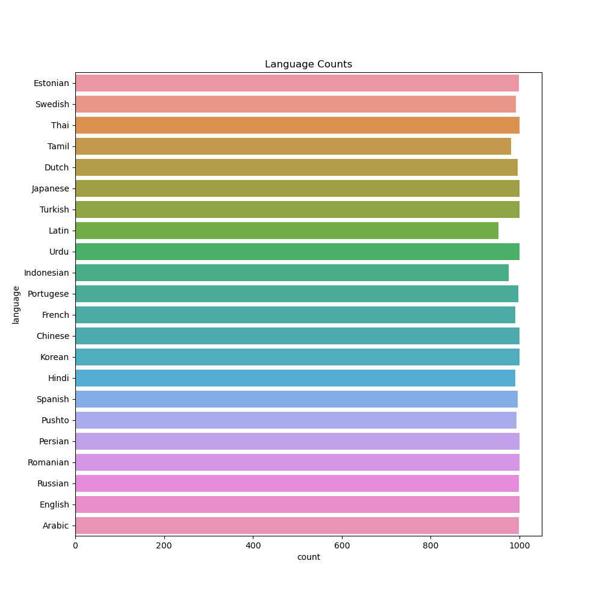
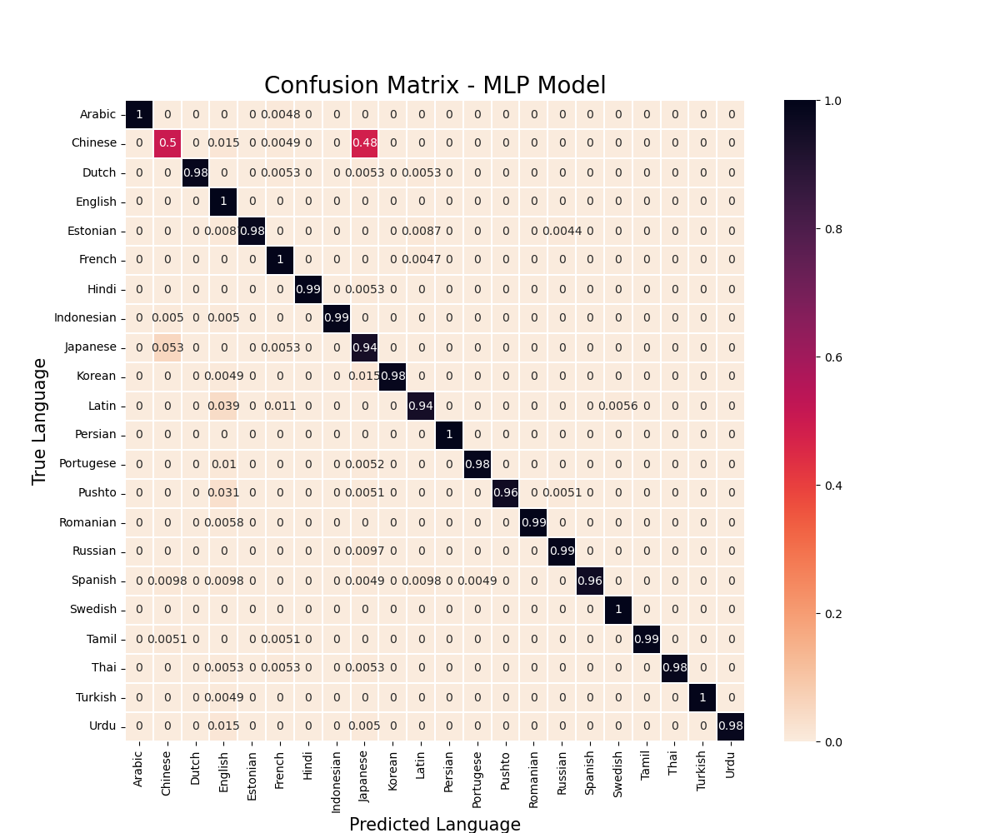
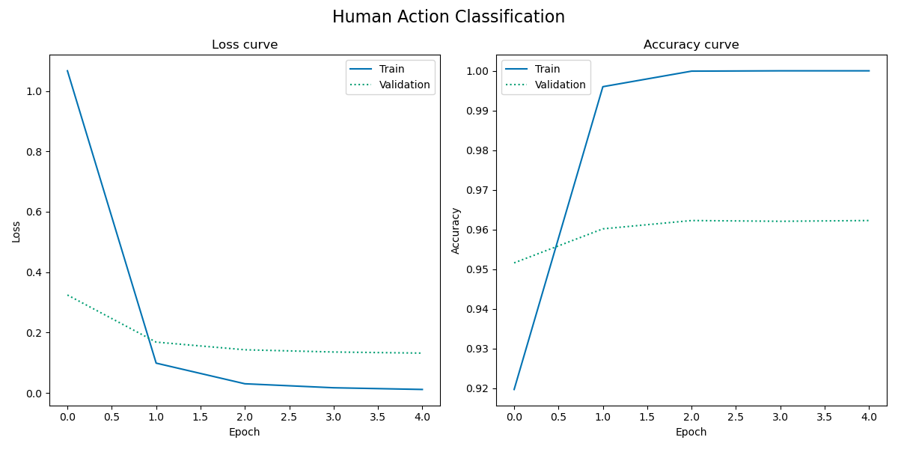

# Assignment 5 - Language Detection
The portfolio for __Language Analytics S22__ consists of 5 projects (4 class assignments and 1 self-assigned project). This is the __fifth and final assignment__ in the portfolio. 

## 1. Contribution
This final project was not made in collaboration with others from the course. I did, however, find a lot of inspiration for how to work with the data from [this Kaggle notebook](https://www.kaggle.com/code/dariussingh/nlp-dl-language-identification).

As mentioned in the `LANG_assignment4` README-file, the [`save_history()`](https://github.com/agnesbn/LANG_assignment5/blob/e0608bfa93e6d0e7654817bd1bce0d4c5dfa2473/src/language_classification.py#L100) function was inspired by a function provided to us by Ross during the course.

The data comes from the [Language Identification dataset](https://www.kaggle.com/datasets/zarajamshaid/language-identification-datasst) on Kaggle and is comprised of 22000 text examples in 22 languages. The data is an excert from the WiLI-2018 dataset (a much larger dataset with data from 235 languages). The 22 languages in the data are: 
- Arabic
- Chinese
- Dutch
- English
- Estonian
- French
- Hindi
- Indonesian
- Japanese
- Korean
- Latin
- Persian
- Portugese
- Pushto (Pashto)
- Romanian
- Russian
- Spanish
- Swedish
- Tamil
- Thai
- Turkish
- Urdu

## 2. Methods
Using the data, I wish to perform two tasks. Firstly, I train a neural network model to do language classification based on the data and secondly, I load the trained model and use it to do classification on unseen data. Thus, the order that the code is run is important – first, run the `language_classification.py` script and make sure the trained model is saved in `utils` and then run `language_prediction.py`.

### Train language classification model
The [`language_classification.py`](https://github.com/agnesbn/LANG_assignment5/blob/main/src/language_classification.py) script loads and reads the input CSV. Before training the model, a number of clean-up functions are run: duplicate sentences are removed, nonalphanumeric characters are removed, the text is tokenised, and characters are lowered. To get an overview of the data after these transformations, a plot of the number of texts per language is saved.

Then, the target labels are encoded using `LabelEncoder()` and the texts are vectorised using `CountVectorizer()`. Now, a train/test split is performed and the data is converted into `NumPy` arrays. An `EarlyStopping()` parameter is configured, so that the model will stop training, if the given metric does not improve for a given number of epochs. Now, the model is created, compiled and trained. The test data is predicted using the model, and the results are saved in the form of a confusion matrix, a history plot, and a classification report. The trained model itself is also saved as a `H5`-file, so that it can be loaded and used for classification.

### Perform language prediction
The [`language_prediction.py`](https://github.com/agnesbn/LANG_assignment5/blob/main/src/language_prediction.py) script runs the same cleaning and processing functions as the `language_classification.py` script in order to have the data labels encoded and the texts vectorised again. Then, the H5-file for the trained model is loaded and used to predict which language occurs in a given input text. The most likely candidate is printed in the command line and an output TXT with the prediction and the original text is saved.

To test the script, I grabbed the first 4-5 lines from a Wikipedia page in each language. I decided to go with the page about that given language, i.e. the page for the "English Language" in English, for "Français" in French etc. The sources for the testing data are:

- Arabic: [https://ar.wikipedia.org/wiki/اللغة_العربية](https://ar.wikipedia.org/wiki/اللغة_العربية).
- Chinese: [https://zh.wikipedia.org/zh-cn/汉语](https://zh.wikipedia.org/zh-cn/汉语).
    - the article is in Simplified Chinese, though the Chinese data from Kaggle seems to include both Traditional and Simplified Chinese – as far as I could tell from checking a few of the texts using a [tool to tell if a text is simplified or traditional Chinese](https://www.chineseconverter.com/en/convert/find-out-if-simplified-or-traditional-chinese).
- Dutch: [https://nl.wikipedia.org/wiki/Nederlands](https://nl.wikipedia.org/wiki/Nederlands).
- English: [https://en.wikipedia.org/wiki/English_language](https://en.wikipedia.org/wiki/English_language).
- Estonian: [https://et.wikipedia.org/wiki/Eesti_keel](https://et.wikipedia.org/wiki/Eesti_keel).
- French: [https://fr.wikipedia.org/wiki/Français](https://fr.wikipedia.org/wiki/Français).
- Hindi: [https://hi.wikipedia.org/wiki/हिन्दी](https://hi.wikipedia.org/wiki/हिन्दी).
- Indonesian: [https://id.wikipedia.org/wiki/Bahasa_Indonesia](https://id.wikipedia.org/wiki/Bahasa_Indonesia).
- Japanese: [https://ja.wikipedia.org/wiki/日本語](https://ja.wikipedia.org/wiki/日本語).
- Korean: [https://ko.wikipedia.org/wiki/한국어](https://ko.wikipedia.org/wiki/한국어).
- Latin: [https://la.wikipedia.org/wiki/Lingua_Latina](https://la.wikipedia.org/wiki/Lingua_Latina).
- Persian: [https://fa.wikipedia.org/wiki/زبان_فارسی](https://fa.wikipedia.org/wiki/زبان_فارسی).
- Portugese: [https://pt.wikipedia.org/wiki/L%C3%ADngua_portuguesa](https://pt.wikipedia.org/wiki/L%C3%ADngua_portuguesa).
- Pushto (Pashto): [https://ps.wikipedia.org/wiki/پښتو](https://ps.wikipedia.org/wiki/پښتو).
- Romanian: [https://ro.wikipedia.org/wiki/Limba_română](https://ro.wikipedia.org/wiki/Limba_română).
- Russian: [https://ru.wikipedia.org/wiki/Русский_язык](https://ru.wikipedia.org/wiki/Русский_язык).
- Spanish: [https://es.wikipedia.org/wiki/Idioma_español](https://es.wikipedia.org/wiki/Idioma_español).
- Swedish: [https://sv.wikipedia.org/wiki/Svenska](https://sv.wikipedia.org/wiki/Svenska).
- Tamil: [https://ta.wikipedia.org/wiki/தமிழ்](https://ta.wikipedia.org/wiki/தமிழ்).
- Thai: [https://th.wikipedia.org/wiki/ภาษาไทย](https://th.wikipedia.org/wiki/ภาษาไทย).
- Turkish: [https://tr.wikipedia.org/wiki/Türkçe](https://tr.wikipedia.org/wiki/Türkçe).
- Urdu: [https://ur.wikipedia.org/wiki/اردو](https://ur.wikipedia.org/wiki/اردو).

(All pages were accessed 24 May 2022)

## 3. Usage
### Install packages
Before running the script, you have to install the relevant packages. To do this, run the following from the command line:
```
sudo apt update
pip install --upgrade pip
pip install pandas numpy scikit-learn tensorflow nltk wordcloud
```

### Get the data
- Download the data here: https://www.kaggle.com/datasets/zarajamshaid/language-identification-datasst.
- Place the data CSV in the `in/data` folder, so that the path to the input data is `in/data/dataset.csv`.

### Language classification
Make sure your current directory is `LANG_assignment5` and then, run:
```
python src/language_classification.py (--plot_name <PLOT NAME> --report_name <REPORT NAME> 
--cm_name <CONFUSION MATRIX NAME> --lc_plot_name <LANGUAGE COUNTS PLOT NAME>) (--epochs <EPOCHS>
--batch_size <BATCH SIZE> --es_patience <EARLY STOPPING PATIENCE> --monitor_metric <MONITORED METRIC>)
```

__Data saving arguments__:
- `<PLOT NAME>`: The name you wish to save the history plot under. The default is `history_plot`.
- `<REPORT NAME>`: The name you wish to save the classification report under. The default is `classification_report`.
- `<CONFUSION MATRIX NAME>`: The name you wish to save the confusion matrix under. The default is `confusion_matrix`.
- `<LANGUAGE COUNTS PLOT NAME>`: The name you wish to save the language counts plot under. The default is `language_counts`. 

__Hyperparameters for model__:
- `<EPOCHS>`: The number of epochs the model runs for. The default is `8`.
- `<BATCH SIZE>`: The size of batches the data is processed by. The default is `256`.
- `<EARLY STOPPING PATIENCE>`: The patience of the early stopping callback function, i.e. how many epochs the model can go without improving before the training is stopped. The default is `1`. 
- `<MONITORED METRIC>`: The metric that the early stopping callback function monitors. The default is `accuracy`.

The classification report and the different result plots are saved in [`out/model_evaluations`](https://github.com/agnesbn/LANG_assignment5/tree/main/out/model_evaluations) and the model itself is saved as `language_identifcation_model.h5` in [`utils`](https://github.com/agnesbn/LANG_assignment5/tree/main/utils).

### Language prediction
- To do the language prediction, place a collection of TXT files which contain the different languages in the `in/language_examples` folder.
    - The files I used to test the script on will be provided on `Digital Eksamen` in the same folder (`in/language_examples`).
- After the data has been placed in the folder, make sure your current directory is `LANG_assignment5` and from the command line, run:
```
python src/language_prediction.py --input <INPUT> (--text_name <TEXT NAME> --directory_name <DIRECTORY NAME>)
```
__Required input__:
- `<INPUT>`: Whether your input is a directory or a single file. To run language prediction for all files in a directory, put in `directory`, and to do the task for a single file, put in `single_text`.

__Optional input__:
- `<TEXT NAME>`: The name of the TXT file, you wish to run the language prediction on (if relevant). The default is `arabic_wiki.txt`.
- `<DIRECTORY NAME>`: The name of the directory with the files, that you wish to run the language prediction on (if relevant). The default is `language_examples`.

The results are printed in the command line as the predictions are made and are also saved in [`out/language_predictions`](https://github.com/agnesbn/LANG_assignment5/tree/main/out/language_predictions).

## 4. Discussion of results
### Language classification
After the initial clean-up of the data, a plot of the number of texts for each language was saved. As you can tell from the plot, there were a few that contained duplicates which were removed.



After training the model, a confusion matrix, a classification report, and a history plot were saved. When running the code with the default hyperparameters (Epochs: 5, Batch size: 256, Patience of Early Stopping: 1, Monitor metric: accuracy), an __accuracy of 96%__ was reached. Noticably, all languages except Chinese and Japanese scored higher than 90% in accuracy, where Japanese only scored 74% and Chinese scored as low as 64%. As we can see from the confusion matrix, the __Chinese texts were often categorised as Japanese__. This probably has something to do with the fact that the Chinese data consist of both Traditional and Simplified Chinese texts. As Japanese uses Traditional Chinese characters, the model most likely has a harder time distinguishing Chinese from Japanese, when it is written with Traditional characters.

__The confusion matrix__                       |  **The history plot**
:---------------------------------------------:|:-------------------------------------------:
|  

The history plot suggests that a longer training time would most likely not improve the results, as the loss and accuracy curve for the training data already begins to flatten after the first epoch.

### Language prediction
When running the language prediction script on the language examples data, that I collected, __all languages were correctly identified__. This was expected for most of the languages, but the fact that the Chinese data was correctly identified probably has to do with the fact that the text I chose was written in Simplified Chinese. When I tried doing the prediction for Traditional Chinese, it was more often than not classified as Japanese.
